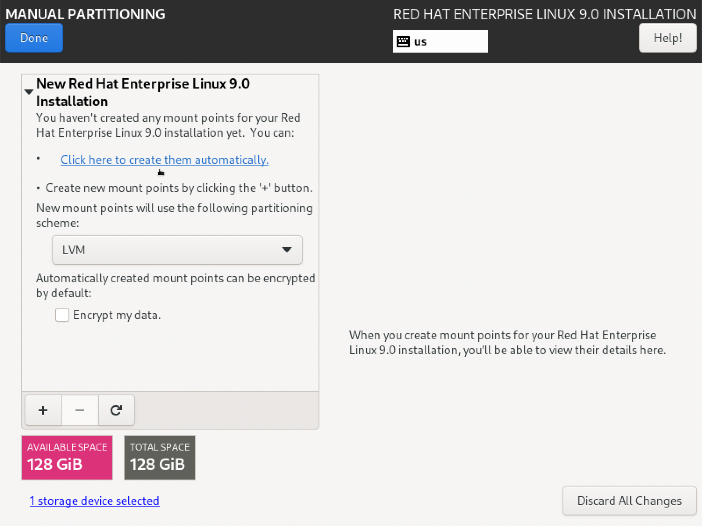
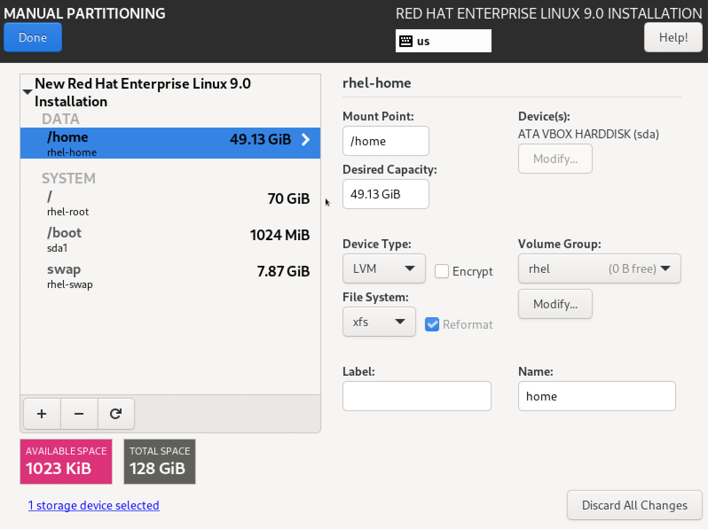
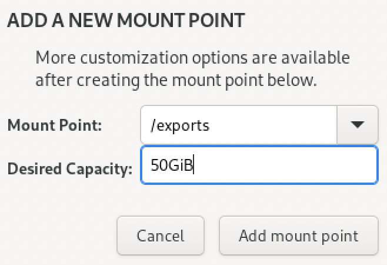

# Configure NFS Server
This project helps configure an NFS server that can then be used
as a dynamic storage provider for OpenShift using the upstream
[Kubernetes NFS Subdir External Provisioner](https://github.com/kubernetes-sigs/nfs-subdir-external-provisioner).
Most of the work is done via the [Red Hat Labs NFS Helper](https://access.redhat.com/labs/nfshelper/server/).

## Install RHEL
First, install a `minimal` instance of Red Hat Enterprise Linux
(RHEL). You can get access to the official RHEL ISOs through the
[Red Hat Developer](https://developers.redhat.com) web site.

Make sure to provision a separate mount point for the NFS export
directory. During the installation, select __Installation Destination__
from the main installation screen as shown below.

On the __INSTALLATION DESTINATION__ dialog, select __Custom__ under
__Storage Configuration__ as shown below.

On the __MANUAL PARTITIONING__ dialog, select __Click here to create
them automatically__ to create basic set of mount points as shown
below.

Automatically creating mount points will consume all available disk
space. You can free up some space for a separate NFS export mount
point by selecting the existing mount points for `/home` and `/`
and reducing their size. Here's some [general advice](https://access.redhat.com/documentation/en-us/red_hat_enterprise_linux/9/html-single/performing_a_standard_rhel_installation/index#advice-on-partitions_partitioning-reference)
on partition sizes that may be helpful.

Finally, add a mount point for NFS exports by selecting `+` below
the list of current mount points. When the dialog appears, provide
the desired values for the filesystem location of the `Mount Point`
and the `Desired Capacity` as shown below.

Finally, click `Done` and continue with the RHEL installation.

In my installation, I created a user with system administration
privileges, disabled the root account, and selected a `minimal`
installation. After the installation is complete, RHEL will reboot
to a login prompt.

## Review the configuration file
Copy or clone this repository to the newly installed RHEL instance.

Edit the `demo.conf` configuration file and make sure to set the
credentials to register for updates, `USERNAME` and `PASSWORD`, on
the [Red Hat Customer Portal](https://access.redhat.com). If you
accessed RHEL via the [Red Hat Developer](https://developers.redhat.com),
you can set these credentials to match.

Make sure that the `SERVERNAME` matches the intended hostname for
your NFS server. If you need to configure an authoritative DNS
server for your local network, you can follow these [instructions](https://github.com/rlucente-se-jboss/configure-caching-dns).

## Register and update the server
Run the first script to register the server for updates and update
all of the packages.

    sudo ./01-setup-rhel.sh

## Generate the configuration for the NFS server using Red Hat Labs
There are multiple [Red Hat Customer Portal Labs](https://access.redhat.com/labs)
to simplify configuration of your server. We'll use the
[NFS Helper](https://access.redhat.com/labs/nfshelper/server/)
lab to install and configure an NFS server.

Browse to the [NFS Helper](https://access.redhat.com/labs/nfshelper/server/)
lab. Make sure that __Configure a NFS Server__ is selected. Set the
__NFS V4 Domain Name__ to match your local network domain as shown
below.

[NFS Helper](images/nfs-helper-main.png)

Scroll down and set the __Server Directory Export__ to match the
mount point you created for NFS exports during installation. Make
sure to also select __Yes__ for the __Configure Advanced NFS Server
Options__ and also select __Yes__ for __rw_server__ to make the NFS
shares both read/write. See below.

[NFS Server Options](images/nfs-server-options.png)

Click the __Generate__ button and then download the script as shown
below.

[Download NFS Script](images/download-nfs-server-script.png)

Copy the downloaded script to the RHEL instance if it was downloaded
to another system.

## Install and configure the NFS server
Run the generated script to install the NFS utility packages and
configure your server.

    chmod +x nfs_server.sh
    sudo ./nfs_server.sh

Answer the various prompts to finish configuring the NFS server and
it's exports.

